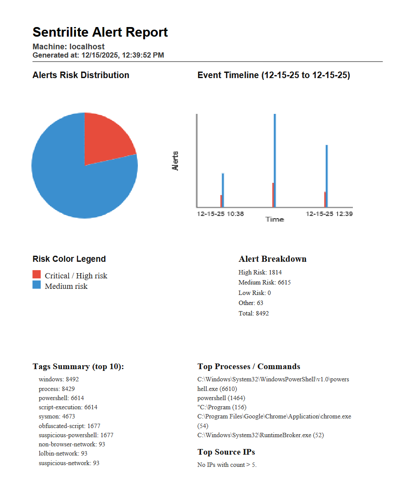
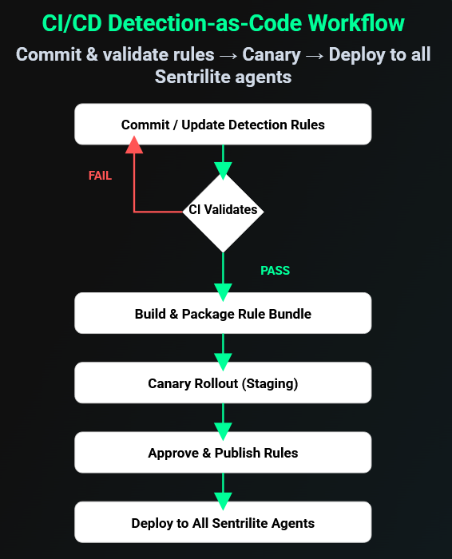
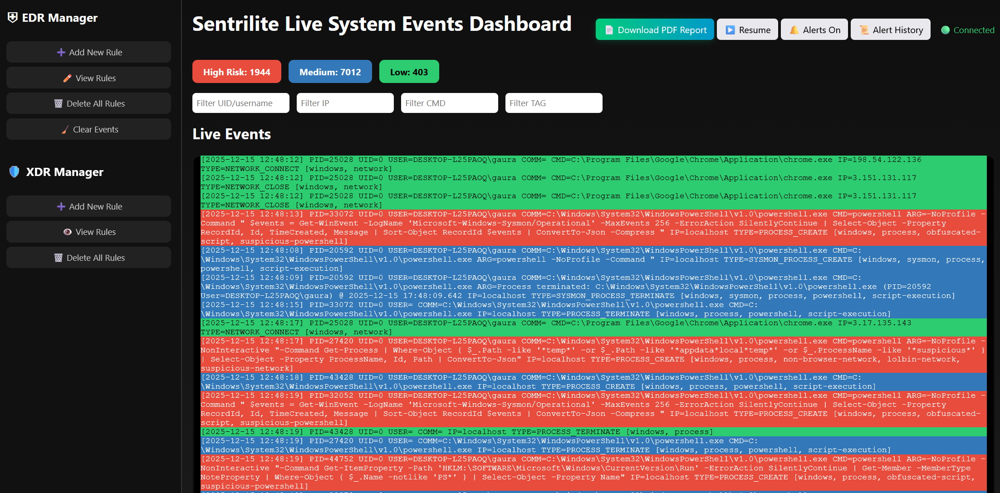

# Sentrilite EDR/XDR for Windows — Threat-Detection-as-Code, Observability, Runtime-Security, Live Telemetry, Misconfig Scanner with AI/LLM insights.

# Sentrilite Alert Report

# CI/CD Workflow

# Main Dashboard

# Live Server Dashboard


# Sentrilite EDR/XDR for Windows

Sentrilite EDR/XDR for Windows is a lightweight Detection-as-Code (DAC), real-time endpoint security and observability platform. It streams structured system events to a live dashboard where JSON rules drive risk scoring, tagging, alerting, and reporting.

It provides a low-overhead endpoint security layer for Windows servers and workstations without requiring heavyweight EDR agents. If Sysmon is present, Sentrilite can automatically enrich coverage by ingesting Sysmon logs; if not, it falls back to its own native collectors.

## What Sentrilite Collects on Windows

### Process Activity Monitoring

Sentrilite captures all process creation and termination and normalizes them into a unified event model:
- Full executable path (cmd / comm)
- Parent PID / child PID
- User / SID context (e.g., NT AUTHORITY\SYSTEM, local users)
- Timestamps
- Tags (e.g., windows, process, powershell, lolbin-network)

You can write rules for:
- Suspicious binaries (e.g., powershell.exe, wscript.exe, certutil.exe)
- LOLBins and lateral-movement tools (psexec.exe, wmic.exe, wmiprvse.exe)
- Obfuscated or encoded script execution (e.g., -EncodedCommand, FromBase64String()
- Unexpected parent-child chains (e.g., winword.exe → powershell.exe)

### File Access Monitoring (Rule-Driven)

The Windows agent detects sensitive file usage via process arguments and custom file rules, using custom_rules.json and sensitive_files.json:
- High-risk alerts for reads/writes to sensitive paths (credentials, config, keys, etc.)
- Tag events with categories such as:
- exfiltration
- credential-access
- custom tags like "gaurav" for your own watch files

### Network Activity Monitoring

Sentrilite monitors outbound connections via Windows networking APIs (GetExtendedTcpTable), producing events that include:
- Local address / port
- Remote address / port
- Protocol (TCP)
- Owning process (image path)
- User context
- Basic connection state (LISTEN, ESTABLISHED, etc.)
- Rules can differentiate between:
- Browser baseline traffic vs. non-browser processes making external connections
- System services vs. unexpected user processes
- Access to special IPs (e.g., cloud metadata 169.254.169.254)

### Optional Sysmon-Aware Enrichment

If Sysmon and the Microsoft-Windows-Sysmon/Operational log are available, Sentrilite starts a Sysmon reader loop that:
- Polls Sysmon events via Get-WinEvent
- Maps them into the same Event structure as native events
- Adds a sysmon tag plus category tags:
- process (Event ID 1)
- network (ID 3)
- driver (ID 6)
- module-load (ID 7)
- file (ID 11)
- registry (IDs 12, 13, 14)
- wmi (IDs 19, 20, 21)
- dns, network (ID 22)
- Keeps Arg1 concise and structured (short summaries rather than raw multi-line blobs)

### Key point:

Sentrilite works without Sysmon, but if Sysmon is installed, you automatically get richer coverage with the same rule engine, same WebSocket pipeline, and same alert model.

### Detection-as-Code (DAC)

Detection logic is fully programmable using JSON:
Rule files:
- custom_rules.json
- windows_security_rules.json (Details in WINDOWS_SECURITY_RULES_DESCRIPTION.md)
- sensitive_files.json

### Hot reload:

Rule files are reloaded on change — no rebuilds, no restarts.
Match on any event field, including:
- cmd, comm
- arg1 (first argument / summarized payload)
- user
- ip
- msg_type_str (e.g., PROCESS_CREATE, SYSMON_DNS_QUERY)
- tags
- aliases like file, iid mapped into shared fields
Rules can:
- Assign risk levels: 1 = high, 2 = medium, 3 = low
- Add custom tags for later correlation / dashboards
- Trigger alerts automatically when conditions match
  (e.g., high-risk PowerShell with encoded commands, LSASS access, non-browser outbound network, WMI-based lateral movement)

This gives Windows administrators full programmability over detection logic without touching code.

---

## 🔐 Licensing

The project is currently using a trial license.key .

---

## 🛠️ Third-Party Integrations (PagerDuty & Alertmanager)

- PagerDuty
- Alertmanager (Prometheus ecosystem)
- SIEM forwarding (JSON events)

---

## 🛠️ Installation Steps

In a Powershell Terminal run:
```
.\sentrilite.exe
```
Open the dashboard.html to check live telemetry:

---

## Configuration

- license.key — place in the current directory (baked in image or mounted as Secret).
- sys.conf — network config, placed in the current directory (baked in image or mounted as ConfigMap).
- Rule files - (custom_rules.json, sensitive_files.json, windows_security_rules.json) reside in the working dir; rules can be managed via the dashboard.

---

## Alerts

When a rule marks an event as high-risk, Sentrilite:
- Creates a structured alert (JSON)
- Pushes it in real time to the dashboard
- Saves it to alerts.json
- Marks the node as “high risk” (risk-level = 1)
- Can forward to external systems (PagerDuty, AlertManager)

Alerts include:
- Process info
- User identity
- Risk reasoning via tags
- File paths or network destinations
- Human-readable summaries

---

## Support

For licensing, troubleshooting, or feature requests:
- 📧 info@sentrilite.com
- 🌐 https://sentrilite.com
